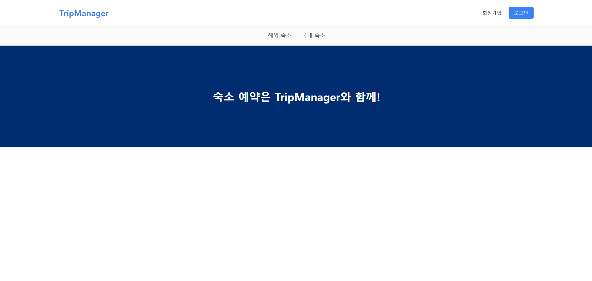
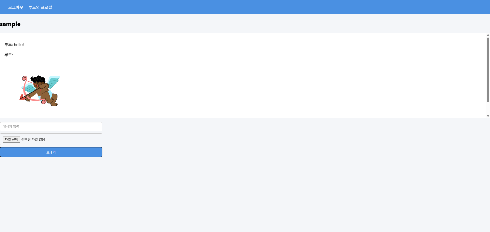
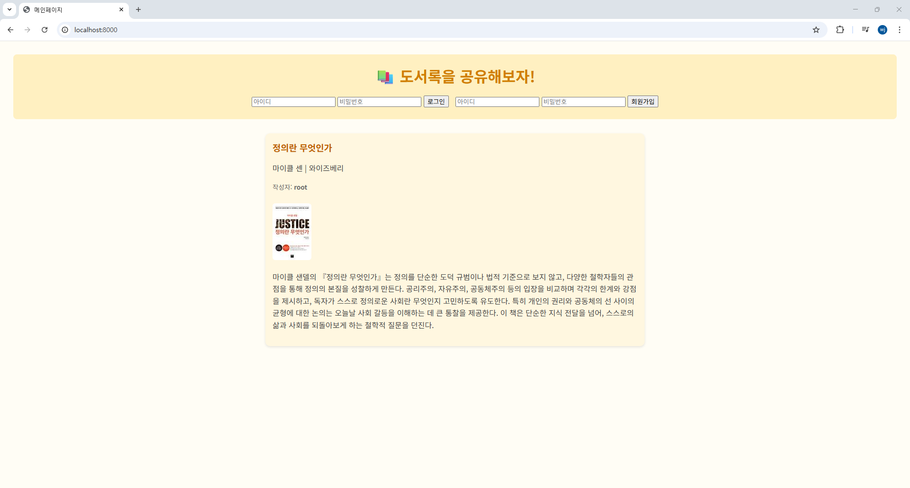
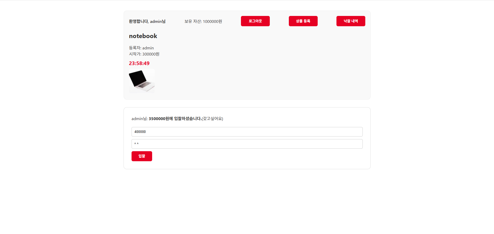
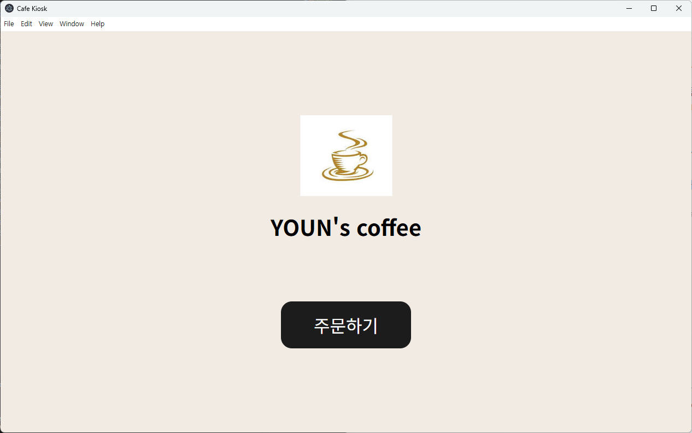

대학 및 개인 학습 과정에서 수행한 백엔드, 실시간 통신, 시스템 설계 중심 프로젝트를 정리한 포트폴리오입니다.

**주요 구성** 
- Node.js 기반 서버 개발
- WebSocket 실시간 통신
- DB 설계
- Android / IoT 연동

---

## [About Me]
- 이름: 윤원준
- 전공: 컴퓨터 공학 
- 관심 분야
  - 백엔드 서버 개발
  - 실시간 통신
  - DB 설계
---

## [Project Overview]

아래는 주요 프로젝트 요약입니다.  
각 프로젝트는 개별 GitHub 저장소로 관리되며, 상세 내용은 링크를 통해 확인할 수 있습니다.

---

### [Smart Study Desk Module - Capstone Project]

**IoT 기반 학습 환경 관리 시스템**

- 파이썬 기반 졸음 감지 및 CO₂ 농도 측정 시스템
- Node.js 서버를 통한 기기–앱 간 실시간 제어
- Android 앱을 통한 설정 및 학습 기록 관리

**Tech Stack**
- Backend: Node.js, Express, WebSocket
- Database: MySQL, Sequelize
- Device: Raspberry Pi, Python
- App: Android (Kotlin)

🔗 Repository  
https://github.com/WJ718/capstone-smart-desk-module

---

### [hotel_reservation_service]

**토스페이먼츠 API 활용 숙소 예약 플랫폼**

- 특정 날짜 선택 후 결제
- 결제 및 예약 기록 DB저장
- node-cron 통한 결제 실패 스케줄러 구현
- 토스페이먼츠 API를 활용한 결제 요청 / 확인

**Tech Stack**
- Backend: Node.js, Express
- Database: MySQL, Sequelize

🔗 Repository  
https://github.com/WJ718/hotel_reservation_service

---

### [GIF Chat Platform]

**WebSocket 기반 실시간 채팅 플랫폼**

- 다중 채팅방 생성 / 입장 / 삭제
- 실시간 텍스트 메시지 송수신
- GIF 이미지 업로드 및 공유

**설계 포인트**
- 이미지 파일은 HTTP URL로 전달하여 WebSocket 트래픽 최소화
- 서버–클라이언트 간 역할 분리

**Tech Stack**
- Backend: Node.js, Express
- Database: MySQL, Sequelize

🔗 Repository  
https://github.com/WJ718/gifchat_platform

---

### [Booknote Platform]

**개인 독서 기록 관리 웹 서비스**

- 사용자 인증 기반 독서 기록 CRUD
- 게시글, 이미지 업로드, 댓글 기능
- 관계형 DB 기반 설계 (User–Post–Comment)

**Tech Stack**
- Backend: Node.js, Express
- Database: MySQL, Sequelize

🔗 Repository  
https://github.com/WJ718/booknote-platform

---

### [auction_platform]

**실시간 경매 플랫폼**

- socket.io 기반 실시간 통신
- Node-schedule 기반 자동 낙찰 스케줄러 구

**Tech Stack**
- Backend: Node.js, Express
- Database: MySQL, Sequelize

🔗 Repository  
https://github.com/WJ718/auction_platform

---

### [cafe-kiosk]

**electron 기반 키오스크 프로그램**

- 정적 데이터와 동적 데이터 관리 차별화

**Tech Stack**
- Backend: Node.js, Express, Electron
- Database: MySQL, Sequelize

🔗 Repository  
https://github.com/WJ718/cafe-kiosk

---

### [Algorithm Study (Baekjoon)]

**알고리즘 문제 풀이 및 정리 저장소**

- 알고리즘, 자료구조 공부 내용 저장

🔗 Repository  
https://github.com/WJ718/study-Baekjoon
